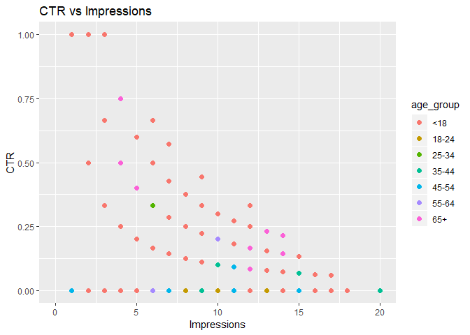
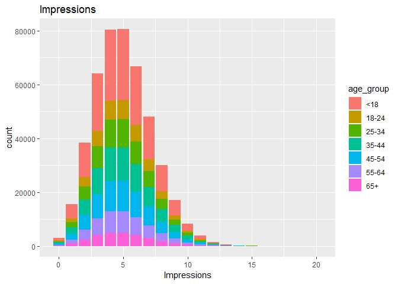
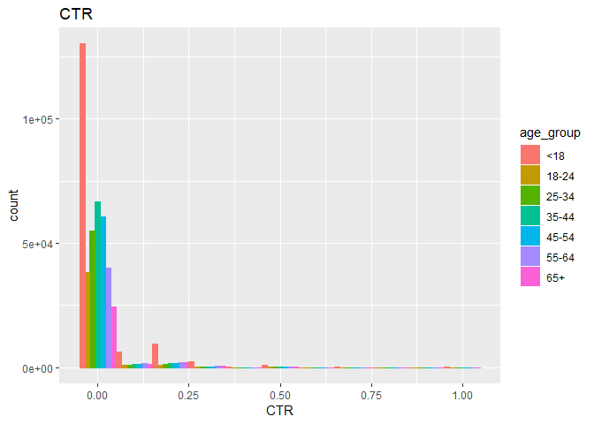
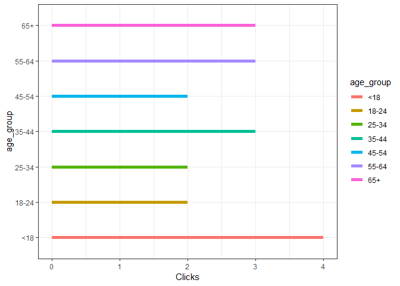
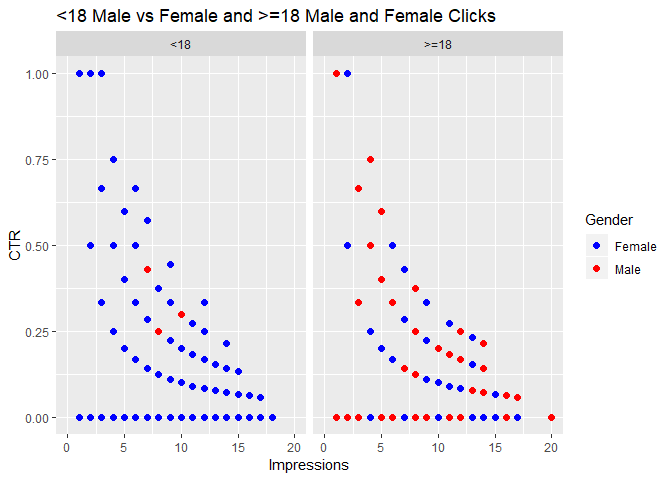
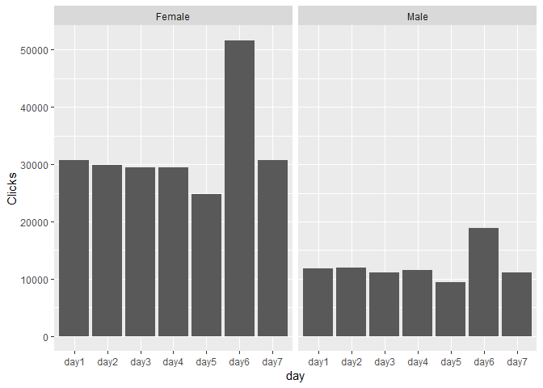
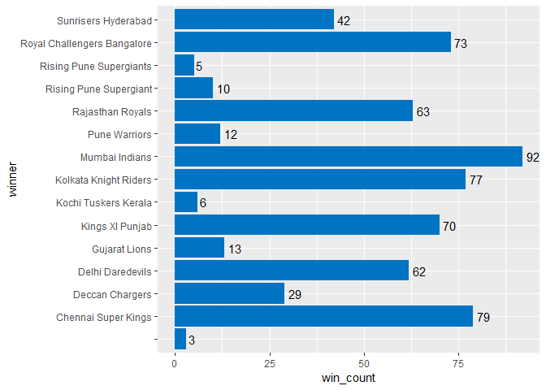
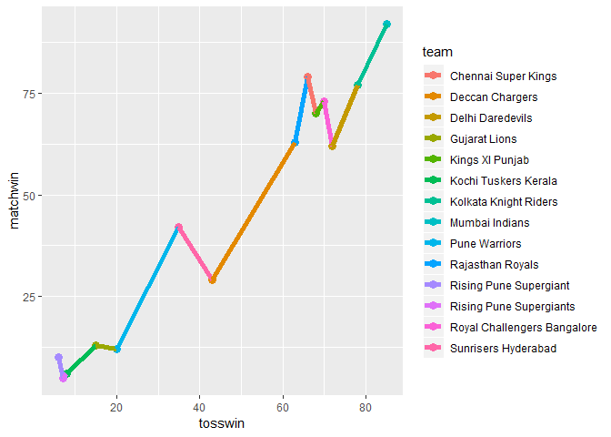

**Q1) a. Creating a new variable age\_group**

    nyt1 <- read.csv("C:\\Users\\welcome\\Desktop\\Stuff\\MEngg\\Sem-1\\DS\\nyt1.csv")

    # Dividing Age into different categories
    nyt1$age_group <- cut(nyt1$Age, c(0,18,25,35,45,55,65,Inf), right= FALSE, labels = c("<18","18-24","25-34","35-44","45-54","55-64","65+"))

    # Summary
    summary(nyt1)

    ##       Age             Gender       Impressions         Clicks       
    ##  Min.   :  0.00   Min.   :0.000   Min.   : 0.000   Min.   :0.00000  
    ##  1st Qu.:  0.00   1st Qu.:0.000   1st Qu.: 3.000   1st Qu.:0.00000  
    ##  Median : 31.00   Median :0.000   Median : 5.000   Median :0.00000  
    ##  Mean   : 29.48   Mean   :0.367   Mean   : 5.007   Mean   :0.09259  
    ##  3rd Qu.: 48.00   3rd Qu.:1.000   3rd Qu.: 6.000   3rd Qu.:0.00000  
    ##  Max.   :108.00   Max.   :1.000   Max.   :20.000   Max.   :4.00000  
    ##                                                                     
    ##    Signed_In      age_group     
    ##  Min.   :0.0000   <18  :150934  
    ##  1st Qu.:0.0000   18-24: 40694  
    ##  Median :1.0000   25-34: 58174  
    ##  Mean   :0.7009   35-44: 70860  
    ##  3rd Qu.:1.0000   45-54: 64288  
    ##  Max.   :1.0000   55-64: 44738  
    ##                   65+  : 28753

**Q1) b. (i) Plotting Impressions and CTR for 6 categories**

    library(ggplot2)

    #CTR vs Impression Graph

    g1 <- ggplot(nyt1, aes(x=Impressions,y=((Clicks/Impressions)),color= age_group)) +geom_point(size = 2) + labs(title="CTR vs Impressions")

    g1 + labs(y="CTR")

    ## Warning: Removed 3066 rows containing missing values (geom_point).

    #Impressions

    library(ggplot2)

     

    b <- ggplot(nyt1, aes(Impressions, fill=age_group))
    b+ geom_bar() + labs(title="Impressions")

    #CTR  

    ctr <- ifelse(nyt1$Impressions !=0, nyt1$Clicks/nyt1$Impressions,NA)

    nyt1$CTR <- ctr

    c <- ggplot(data = nyt1,aes(CTR, fill = age_group, color = age_group))
    c +  geom_histogram(position = "dodge", binwidth = 0.1) +  labs(x = "CTR",title="CTR")

    ## Warning: Removed 3066 rows containing non-finite values (stat_bin).

 **Q1)b.
(ii) New Variable to segment by click behaviour**

    #Plot to visualise clicks by different age groups

    ggplot(nyt1, aes(y=age_group, x=Clicks, color=age_group)) + geom_line(size=2) + theme_bw()

 **Less
than 18 year segment recorded highest number of clicks by &lt;18
followed by 55+ , 35-44 and other segments.** **So, I categorised with
the new variable "Click\_Behavior". (Zero, Low, Medium and High) as
shown.**

    nyt1$Click_Behavior <- ifelse(is.na(nyt1$CTR), 'NA', ifelse(nyt1$CTR==0, 'Zero',ifelse(nyt1$CTR>0 & nyt1$CTR<=0.2, 'Low', 
                                         ifelse(nyt1$CTR>0.2 & nyt1$CTR<=0.4, 'Medium',
                                                'High'))))
    summary(nyt1$Click_Behavior)

    ##    Length     Class      Mode 
    ##    458441 character character

**Q1) b. (iii) Visual Comparisions**

    library(ggplot2)
    segment <- ifelse(nyt1$Age < 18,c("<18"), c(">=18")) 

    nyt1$Segment <- segment

    d<- ggplot(nyt1, aes(y=CTR, x=Impressions, color=factor(Gender))) + geom_point(data=subset(nyt1, Segment=='<18'),size=2) + labs(title="<18 Male vs Female", y="CTR", color="Gender") 

    d + geom_point(data=subset(nyt1, Segment=='>=18'),size=2) + labs(title="<18 Male vs Female and >=18 Male and Female Clicks", y="CTR", color="Gender") +scale_color_manual(labels = c("Female", "Male"), values = c("blue", "red")) + facet_grid(.~ Segment)

    ## Warning: Removed 1025 rows containing missing values (geom_point).

    ## Warning: Removed 2041 rows containing missing values (geom_point).

**Q1) C. Potential Metrics and Weekly Trend**

    #As we estimated female under 18 recorded highest number of clicks, taking their mean would estimate their age on an average. (Taking age>0)

    mean(nyt1[nyt1$Age>0 & nyt1$Age<18 & nyt1$Gender==0,"Age"])

    ## [1] 15.24621

    var(nyt1[nyt1$Age>0 & nyt1$Age<18 & nyt1$Gender==0, "Age"])

    ## [1] 2.914118

*15 years is the average female age with variance 3 recording highest
number of clicks. The max value is 17.*

    mean(nyt1[nyt1$Age>=18 & nyt1$Gender==1,"Age"])

    ## [1] 42.34767

    median(nyt1[nyt1$Age>=18 & nyt1$Gender==1,"Age"])

    ## [1] 41

*As Men recorded highest number of clicks in the segment &gt;=18 years
are 42 years old on an average. Median is 41 (distribution will be
skewed to the right) *

    #R Code for visualizing weekly trend

    nyt1 <- read.csv("C:\\Users\\welcome\\Desktop\\Stuff\\MEngg\\Sem-1\\DS\\nyt1.csv")
    nyt2 <- read.csv("C:\\Users\\welcome\\Desktop\\Stuff\\MEngg\\Sem-1\\DS\\nyt2.csv")
    nyt3 <- read.csv("C:\\Users\\welcome\\Desktop\\Stuff\\MEngg\\Sem-1\\DS\\nyt3.csv")
    nyt4 <- read.csv("C:\\Users\\welcome\\Desktop\\Stuff\\MEngg\\Sem-1\\DS\\nyt4.csv")
    nyt5 <- read.csv("C:\\Users\\welcome\\Desktop\\Stuff\\MEngg\\Sem-1\\DS\\nyt5.csv")
    nyt6 <- read.csv("C:\\Users\\welcome\\Desktop\\Stuff\\MEngg\\Sem-1\\DS\\nyt6.csv")
    nyt7 <- read.csv("C:\\Users\\welcome\\Desktop\\Stuff\\MEngg\\Sem-1\\DS\\nyt7.csv")

    nyt1$day <- "day1"
    nyt2$day <- "day2"
    nyt3$day <- "day3"
    nyt4$day <- "day4"
    nyt5$day <- "day5"
    nyt6$day <- "day6"
    nyt7$day <- "day7"

    nyt <- rbind(nyt1, nyt2, nyt3, nyt4, nyt5, nyt6, nyt7)

    levels(nyt$day) <- list('day1' = 'day1',
                            'day2' = 'day2',
                            'day3' = 'day3',
                            'day4' = 'day4',
                            'day5' = 'day5',
                            'day6' = 'day6',
                            'day7' = 'day7')

    nyt$Gender <- ifelse(nyt$Gender == 0, 'Female','Male')

    week <- ggplot(nyt, aes(x=day, y=Clicks))
    week + geom_bar(stat = "identity") + facet_grid(.~ Gender) 

<ul>
<h3>
Patterns Observed
</h3>
    <li>Less than 18 segment record the highest CTR among all the age groups. Female under 18 have the highest clicks than females who are more than 18 years old. Males who are above 18 years record more clicks than who are less than 18 years and Males record more number of clicks than female in the above 18 segment having an average age of 42 years.</li>

<li>
However, the CTR rate for most of male and female is less than 0.2.
</li>
<li>
In Weekly trend, it is clear that overall female clicks are higher than
male. It is also evident that Day 6 records highest number of clicks in
female and male graph. In all the other days, almost equal number of
clicks were recorded in female and male respectively.
</li>
Q2) Dataset Chosen: IPL Dataset(Cricket Dataset)
------------------------------------------------

*IPL Dataset (Cricket Dataset) has details of all the matches in all
seasons with team1, team2 , toss\_winner, toss\_decision, winner,
win\_by\_runs, win\_by\_wickets and other details.*

**Q2) a. Visualising the number of matches played and victories per
team**

    matches <- read.csv("C:\\Users\\welcome\\Desktop\\Stuff\\MEngg\\Sem-1\\DS\\matches.csv")
    library(dplyr)

    ## 
    ## Attaching package: 'dplyr'

    ## The following objects are masked from 'package:stats':
    ## 
    ##     filter, lag

    ## The following objects are masked from 'package:base':
    ## 
    ##     intersect, setdiff, setequal, union

    matches %>% summarise(match_count = n())

    ##   match_count
    ## 1         636

    library(dplyr)
    library(ggplot2)

    #wins - groups by winner(team_name) with number of victories

    wins = matches %>% group_by(winner) %>% summarise(win_count = n())

    ggplot(wins, aes(x=winner,y=win_count)) + geom_bar(fill="#0073C2FF", stat="identity") + geom_text(aes(label=win_count), hjust= -0.3) +  coord_flip()

 *Plot was made to compare between Toss wins and Match wins. How
likely toss winning and match winning are.*

    toss_win <- matches %>% group_by(toss_winner) %>% summarise(toss_count=n())
    wins <- wins [-1,]

    total <- data.frame(team=toss_win$toss_winner, tosswin=toss_win$toss_count,matchwin=wins$win_count )

    ggplot(total, aes(x=tosswin, y=matchwin, group=1, color=team))+ geom_point(size=3) + geom_line(size=2)

Data was made usable
--------------------

*- By removing columns with most number of NA (Made whole column null in
the data frame)* *- Rows having NULL values (or) empty strings are
removed.*

Interpretations
---------------

*- Mumbai Indians recorded highest number of victories while kochi
tuskers and Pune Warriors record lowest number of victories in all
seasons*

*- Chennai Super Kings, Kolkata Knight Riders toss winning and match
winning is most likely followed by Rising Pune Supergaint.*
